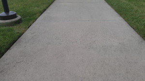
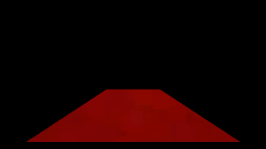

# Pathfinder

## Introduction
This project is to create a vehicle capable of navigate sidewalks and other similiar pathway autonomously
## Prereqs
Before attempting to run this project make sure that you have run the setup.sh file
## Developed on
* macOS Sierra v10.12.6
* Raspberry Pi 2 B+
* Raspbian 
* Python 3.6
## Additional Dependencies 
This project utilizes:
* Homebrew v1.3.2
* 
## The Wiring 
    [Make Fritzing Diagram of Car]
## Power 
* This Pi in this project is powered by a 1500mah External Mophie battery case
* The electronic speed controller is powered by the stock ArDrone 2.0 battery
## Training Data
* ### Collection
    In order to collect training data for this three cameras are attached to the vehicle facing forward, left and right. The vehicle was then driven manually making sure to stay relatively close to the center of the pathway. After which each respective cameras view was given the label of right,left or forward
> Note: This collection method was borrowed from Nikolai Smolyanskiy's paper on [Low-Flying Autonomous MAV Trail Navigation using Deep Neural Networks for Environmental Awareness](https://arxiv.org/abs/1705.02550)
* ### Training
    This project current uses the built-in Gaussian Naive-Bayes Classifier for determining which direction to rotate the turning servo
## Testing Data
* ### Collection

     

    The vehicle connects to a stock _____ 1080p webcam which has been set to capture frames at 320 X 240 resolution in order to reduce computational load. 
* ### Processing
     

    Once a frame is captured all except the lower front area of the image is filtered out, the image pixels are dialated and converted to HSV format.

     

    The program then finds the maximum and minimum hue values in this selected region and finds and removes any pixels in the original image which are not within this range in order to create the testing mask.
    

> Note: The code for filtering out image portion is from naokishibuya's project on [Finding Lane Lines](https://github.com/naokishibuya/car-finding-lane-lines)
* ### Prediction
    At the programs launch it loads in a pretrained classification model and feeds
## Pedestrian Avoidance

## Start-up
Once Host_process is launched it will automatically recalibrate the ESC and load the pretrained classification model.
At the moment inorder to begin the driving script the user must answer "yes" to a terminal prompt. Once the started the driving motor is run at 1/4 of its max speed and begin to classify and react to turns in the path
## Interfacing
[Add Image of Interface]
* Once the program is launched and the car and client are on the same network it will start to host a Flask server on port 5000 of its current ip. This webpage currently allows you to see the vehicles camera view.

### In-Development
* Enabling PHP on Flask Server so that an Emergency Stop function can be called from the webpage
* Remote Monitering of the CPU Temperature and Load
* Translation of Code to C++
* Use of K-Nearest Classification Method in place of Gaussian Classifier

### Future Developments
* Utilizing the Intel RealSense 
VF0810 Camera's Depth tracking capabilities to allow for more adaptive obstacle avoidance
* Control the autonomous vehicle using the Intel Joule 570X
* Connecting a GPS module to the device 
* Creating Waypoints to follow with Google Maps Directions API

### Commonly Experienced Errors
* Path Tracking is unreliable at night and in shaded areas

### Additional Documentation
- [Flask Video Stream Tutorial](https://blog.miguelgrinberg.com/post/video-streaming-with-flask)
- [Hue Filtering Forum](_blank)
- [Brushless ESC Control Instructables](http://www.instructables.com/id/Driving-an-ESCBrushless-Motor-Using-Raspberry-Pi/)